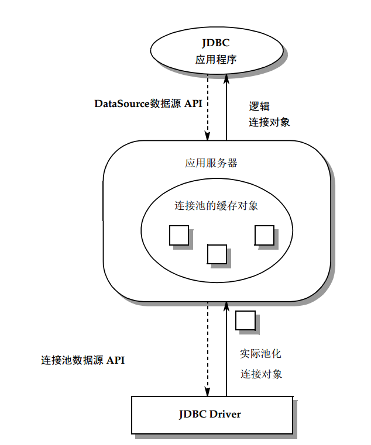
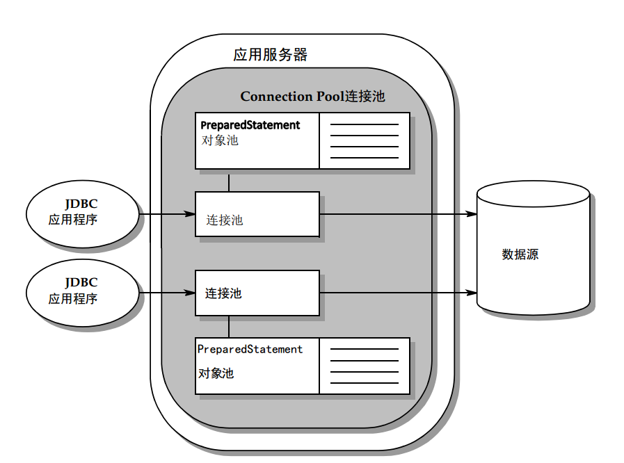

# 11. Connection Pooling（连接池）

在基本的数据源实现中，客户端的 `Connection` 对象与物理数据库连接之间存在 1:1 的对应关系。当 `Connection` 对象被关闭时，物理连接也会被断开。因此，每个客户端会话都需要经历打开、初始化和关闭物理连接的开销。

连接池解决了这个问题，通过维护一个物理数据库连接的缓存，使得这些连接可以在多个客户端会话之间重用。连接池显著提高了性能和可扩展性，尤其是在三层环境中，多个客户端可以共享较少的物理数据库连接。

在图 11-1 中，JDBC 驱动程序提供了 `ConnectionPoolDataSource` 的实现，应用服务器使用它来构建和管理连接池。用于管理连接池的算法是特定于实现的，并且在不同的应用服务器之间有所不同。应用服务器为其客户端提供了一个 `DataSource` 接口的实现，使得连接池对客户端透明。因此，客户端在使用相同的 JNDI 和 DataSource API 的同时，能够获得更好的性能和可扩展性。




以下章节介绍了 `ConnectionPoolDataSource` 接口、`PooledConnection` 接口和 `ConnectionEvent` 类。这些组件在客户端使用的 `DataSource` 和 `Connection` 接口下层运行，融入了典型连接池实现的逐步描述。本章还描述了一些基本 `DataSource` 对象与实现连接池的对象之间的重要差异。此外，还讨论了池化连接如何维护一个可重用的 `PreparedStatement` 对象池。

虽然本章的大部分讨论假设了三层环境，但连接池在两层环境中也同样适用。在两层环境中，JDBC 驱动程序实现了 `DataSource` 和 `ConnectionPoolDataSource` 接口。这种实现允许一个打开和关闭多个连接的应用程序从连接池中受益。


## 11.1 ConnectionPoolDataSource 和 PooledConnection

通常，JDBC 驱动程序实现 `ConnectionPoolDataSource` 接口，应用服务器使用它来获取 `PooledConnection` 对象。以下代码示例显示了两种版本的 `getPooledConnection` 方法的签名。

```java
public interface ConnectionPoolDataSource {
    PooledConnection getPooledConnection() throws SQLException;
    PooledConnection getPooledConnection(String user, String password) throws SQLException;
    ...
}
```

**代码示例 11-1** `ConnectionPoolDataSource` 接口

`PooledConnection` 对象表示与数据源的物理连接。JDBC 驱动程序的 `PooledConnection` 实现封装了维护该连接的所有细节。

应用服务器在其 `DataSource` 接口的实现中缓存和重用 `PooledConnection` 对象。当客户端调用 `DataSource.getConnection` 方法时，应用服务器使用物理 `PooledConnection` 对象来获取逻辑 `Connection` 对象。

以下代码示例显示了 `PooledConnection` 接口的定义。

```java
public interface PooledConnection {
    Connection getConnection() throws SQLException;
    void close() throws SQLException;
    void addConnectionEventListener(ConnectionEventListener listener);
    void addStatementEventListener(StatementEventListener listener);
    void removeConnectionEventListener(ConnectionEventListener listener);
    void removeStatementEventListener(StatementEventListener listener);
}
```

**代码示例 11-2** `PooledConnection` 接口

当应用程序完成对连接的使用时，它会使用 `Connection.close` 方法关闭逻辑连接。这将关闭逻辑连接，但不会关闭物理连接。相反，物理连接被返回到池中，以便可以被重用。

连接池对客户端是完全透明的：客户端获取一个池化连接，并像获取和使用非池化连接一样使用它。

---

**注意** – 使用连接池时，当调用 `Connection.close` 时，由 `Connection.setClientInfo` 设置的任何属性将被清除。


## 11.2 连接事件

当应用程序调用 `Connection.close` 方法时，底层的物理连接——即 `PooledConnection` 对象——将变得可以重用。使用类似 JavaBeans 的事件机制来通知连接池管理器（应用服务器），表明 `PooledConnection` 对象可以被回收。

为了接收 `PooledConnection` 对象上的事件通知，连接池管理器必须实现 `ConnectionEventListener` 接口，并注册为该 `PooledConnection` 对象的监听器。`ConnectionEventListener` 接口定义了以下两个方法，对应于 `PooledConnection` 对象上可能发生的两种事件：

- **connectionClosed** — 当与该 `PooledConnection` 对象关联的逻辑 `Connection` 对象被关闭时触发，即应用程序调用了 `Connection.close` 方法。
- **connectionErrorOccurred** — 当发生致命错误（例如服务器崩溃）导致连接丢失时触发。

连接池管理器使用 `PooledConnection.addConnectionEventListener` 方法将自己注册为 `PooledConnection` 对象的监听器。通常，连接池管理器在将 `Connection` 对象返回给应用程序之前会先注册自己为 `ConnectionEventListener`。

当对应的事件发生时，驱动程序会调用 `ConnectionEventListener` 的 `connectionClosed` 和 `connectionErrorOccurred` 方法。这两个方法都接受一个 `ConnectionEvent` 对象作为参数，可以用来确定哪个 `PooledConnection` 对象被关闭或发生了错误。当 JDBC 应用程序关闭其逻辑连接时，JDBC 驱动程序会通过调用监听器的 `connectionClosed` 方法来通知连接池管理器（监听器）。此时，连接池管理器可以将 `PooledConnection` 对象返回到池中以便重用。

当发生错误时，JDBC 驱动程序会通过调用监听器的 `connectionErrorOccurred` 方法来通知监听器，并随后抛出一个 `SQLException` 对象来通知应用程序发生了相同的错误。在发生致命错误时，坏掉的 `PooledConnection` 对象不会被返回到池中。相反，连接池管理器会调用 `PooledConnection.close` 方法来关闭物理连接。


## 11.3 三层环境中的连接池

以下步骤概述了当 JDBC 客户端从实现连接池的 DataSource 对象请求连接时发生的情况：

1. **客户端调用 `DataSource.getConnection`。**

2. **提供 DataSource 实现的应用服务器检查其连接池，查看是否有适用的 `PooledConnection` 对象——即物理数据库连接——可用。** 确定给定 `PooledConnection` 对象的适用性可能包括匹配客户端的用户认证信息或应用程序类型，以及使用其他特定于实现的标准。查找方法及其他与管理连接池相关的方法是特定于应用服务器的。

3. **如果没有适用的 `PooledConnection` 对象可用，应用服务器会调用 `ConnectionPoolDataSource.getPooledConnection` 方法以获取新的物理连接。** 实现 `ConnectionPoolDataSource` 的 JDBC 驱动程序会创建一个新的 `PooledConnection` 对象并将其返回给应用服务器。

4. **无论 `PooledConnection` 是从池中获取的还是新创建的，应用服务器都会进行一些内部记录，以表明该物理连接现在正在使用中。**

5. **应用服务器调用 `PooledConnection.getConnection` 方法以获取逻辑 `Connection` 对象。** 这个逻辑 `Connection` 对象实际上是对物理 `PooledConnection` 对象的“句柄”，当连接池生效时，这个句柄就是 `DataSource.getConnection` 方法返回的对象。

6. **应用服务器通过调用 `PooledConnection.addConnectionEventListener` 方法注册自己为 `ConnectionEventListener`。** 这样，应用服务器会在 `PooledConnection` 对象可以被重用时得到通知。

7. **逻辑 `Connection` 对象被返回给 JDBC 客户端，客户端使用与基本 DataSource 情况相同的 Connection API。** 请注意，底层的 `PooledConnection` 对象在客户端调用 `Connection.close` 方法之前不能被重用。

连接池也可以在没有应用服务器的两层环境中实现。在这种情况下，JDBC 驱动程序提供了对客户端可见的 `DataSource` 实现和底层 `ConnectionPoolDataSource` 实现。


## 11.4 DataSource 实现与连接池

除了性能和可扩展性的提升，JDBC 应用程序在访问实现连接池的 DataSource 对象与不实现连接池的 DataSource 对象之间通常不会看到差别。然而，在应用服务器和驱动程序级别的实现上存在一些重要的区别。

### 基本 DataSource 实现

基本的 DataSource 实现，即不实现连接池的实现，通常由 JDBC 驱动程序供应商提供。在基本 DataSource 实现中，以下情况是正确的：

- `DataSource.getConnection` 方法创建一个新的 `Connection` 对象，该对象代表一个物理连接并封装了设置和管理该连接的所有工作。
- `Connection.close` 方法关闭物理连接并释放相关资源。

### 实现连接池的 DataSource

在包含连接池的 DataSource 实现中，许多操作都在后台进行。在这样的实现中，以下情况是正确的：

- DataSource 实现包括一个特定于实现的连接池模块，用于管理 `PooledConnection` 对象的缓存。`DataSource` 对象通常由应用服务器实现，作为驱动程序实现的`ConnectionPoolDataSource` 和 `PooledConnection` 接口的一个层。
- `DataSource.getConnection` 方法调用 `PooledConnection.getConnection` 来获取对底层物理连接的逻辑句柄。只有在连接池中没有现有连接时，才会产生设置新物理连接的开销。当需要新的物理连接时，连接池管理器将调用 `ConnectionPoolDataSource` 的 `getPooledConnection` 方法来创建一个。物理连接的管理工作委托给 `PooledConnection` 对象。
- `Connection.close` 方法关闭逻辑句柄，但物理连接保持不变。连接池管理器会被通知底层 `PooledConnection` 对象现在可以被重用。如果应用程序尝试重用逻辑句柄，`Connection` 实现会抛出 `SQLException`。
- 一个物理 `PooledConnection` 对象在其生命周期内可能会生成许多逻辑 `Connection` 对象。对于给定的 `PooledConnection` 对象，只有最新生成的逻辑 `Connection` 对象是有效的。当调用相关的 `PooledConnection.getConnection` 方法时，任何先前存在的 `Connection` 对象会被自动关闭。在这种情况下，监听器（连接池管理器）不会收到通知。这给应用服务器提供了一种从客户端移除连接的方式。这种情况不太可能发生，但如果应用服务器试图强制有序关闭，这可能会很有用。
- 连接池管理器通过调用 `PooledConnection.close` 方法来关闭物理连接。该方法通常只在某些情况下被调用：当应用服务器正在进行有序关闭时，当连接缓存被重新初始化时，或当应用服务器收到表示连接发生不可恢复错误的事件时。


## 11.5 部署

部署一个实现连接池的 DataSource 对象要求同时将客户端可见的 DataSource 对象和底层的 ConnectionPoolDataSource 对象注册到基于 JNDI 的命名服务中。

### 部署 ConnectionPoolDataSource 实现

第一步是部署 ConnectionPoolDataSource 实现，如 CODE EXAMPLE 11-3 所示：

```java
// ConnectionPoolDS 实现了 ConnectionPoolDataSource 接口。
// 创建一个实例并设置属性。
com.acme.jdbc.ConnectionPoolDS cpds = new com.acme.jdbc.ConnectionPoolDS();
cpds.setServerName("bookserver");
cpds.setDatabaseName("booklist");
cpds.setPortNumber(9040);
cpds.setDescription("Connection pooling for bookserver");
// 使用逻辑名称 "jdbc/pool/bookserver_pool" 将 ConnectionPoolDS 注册到 JNDI
Context ctx = new InitialContext();
ctx.bind("jdbc/pool/bookserver_pool", cpds);
```

### 部署 DataSource 对象

完成这一步后，ConnectionPoolDataSource 实现已作为客户端可见的 DataSource 实现的基础。接下来，部署 DataSource 实现，使其引用 ConnectionPoolDataSource 实现，如 CODE EXAMPLE 11-4 所示：

```java
// PooledDataSource 实现了 DataSource 接口。
// 创建一个实例并设置属性。
com.acme.appserver.PooledDataSource ds = new com.acme.appserver.PooledDataSource();
ds.setDescription("Datasource with connection pooling");
// 引用之前注册的 ConnectionPoolDataSource
ds.setDataSourceName("jdbc/pool/bookserver_pool");
// 使用逻辑名称 "jdbc/bookserver" 将 DataSource 实现注册到 JNDI
Context ctx = new InitialContext();
ctx.bind("jdbc/bookserver", ds);
```

现在，DataSource 对象已经可以在应用程序中使用。


## 11.6 连接池中的语句重用

JDBC 规范支持语句池功能。这一特性允许应用程序像重用连接一样重用 `PreparedStatement` 对象。通过池化连接，这种重用变得可能。

图 11-2 提供了一个逻辑视图，展示了如何将一组 `PreparedStatement` 对象与 `PooledConnection` 对象关联。与 `PooledConnection` 对象一样，`PreparedStatement` 对象可以被多个逻辑连接透明地重用。




在图 11-2 中，连接池和语句池由应用服务器实现。然而，这一功能也可以由驱动程序或底层数据源实现。对语句池的讨论旨在涵盖这些实现方式中的任何一种。


### 11.6.1 使用池化语句

如果池化连接重用语句，则重用过程必须对应用程序完全透明。换句话说，从应用程序的角度来看，使用参与语句池的 `PreparedStatement` 对象与使用非池化的 `PreparedStatement` 对象完全一样。语句在后台保持打开状态以供重用，因此应用程序代码不需要进行任何更改。如果应用程序关闭了一个 `PreparedStatement` 对象，它仍然需要调用 `Connection.prepareStatement` 以再次使用该语句。语句池唯一可见的效果是可能的性能提升。

应用程序可以通过调用 `DatabaseMetaData` 的 `supportsStatementPooling` 方法来检查数据源是否支持语句池。如果返回值为 `true`，则应用程序可以选择使用可能被池化的 `PreparedStatement` 对象。

在许多情况下，重用语句是一种重要的优化，尤其对于复杂的预编译语句。然而，还应注意，保留大量打开的语句可能会对资源使用产生不利影响。

### 11.6.2 关闭池化语句

应用程序关闭池化语句的方式与关闭非池化语句的方式完全相同。不论语句是否被池化，关闭后的语句不再可供应用程序使用，尝试重用将导致异常。

以下方法可以关闭池化语句：

- **`Statement.close`** — 由应用程序调用；如果语句被池化，则关闭应用程序使用的逻辑语句，但不关闭正在池化的物理语句。
- **`Connection.close`** — 由应用程序调用。
- **非池化连接** — 关闭物理连接及由该连接创建的所有语句。这是必要的，因为垃圾回收机制无法检测何时可以释放外部管理的资源。
- **池化连接** — 关闭逻辑连接及其返回的逻辑语句，但保持底层 `PooledConnection` 对象和任何关联的池化语句打开。
- **`PooledConnection.close`** — 由连接池管理器调用，关闭物理连接和由 `PooledConnection` 对象池化的所有物理语句。

应用程序不能直接关闭正在池化的物理语句；此操作由连接池管理器完成。`PooledConnection.close` 方法关闭连接及在给定连接上打开的所有语句，从而释放与这些语句关联的资源。

应用程序也无法直接控制语句如何被池化。语句池与 `PooledConnection` 对象关联，其行为由生成该对象的 `ConnectionPoolDataSource` 对象的属性决定。第 11.8 节“ConnectionPoolDataSource 属性”讨论了这些属性。


## 11.7 语句事件

如果连接池管理器支持 `PreparedStatement` 对象的语句池，它必须实现 `StatementEventListener` 接口，并将其注册为该 `PooledConnection` 对象的监听器。`StatementEventListener` 接口定义了以下两种方法，对应于 `PreparedStatement` 对象上可能发生的两种事件：

- **`statementClosed`** — 当与此 `PooledConnection` 对象关联的逻辑 `PreparedStatement` 对象被关闭时触发，即应用程序调用了 `PreparedStatement.close` 方法。
- **`statementErrorOccurred`** — 当 JDBC 驱动程序确定 `PreparedStatement` 对象不再有效时触发。

连接池管理器通过使用 `PooledConnection.addStatementEventListener` 方法注册自己为 `PreparedStatement` 对象的监听器。通常，连接池管理器会在将 `PreparedStatement` 对象返回给应用程序之前，先将自己注册为 `StatementEventListener`。

驱动程序在发生相应事件时调用 `StatementEventListener` 方法 `statementClosed` 和 `statementErrorOccurred`。这两个方法都接受一个 `StatementEvent` 对象作为参数，可以用来确定哪个 `PreparedStatement` 对象被关闭或发生了错误。当 JDBC 应用程序关闭其逻辑预编译语句时，JDBC 驱动程序通过调用监听器的 `statementClosed` 方法来通知连接池管理器（监听器）。此时，连接池管理器可以将 `PreparedStatement` 对象返回到池中以供重用。

当发生使 `PreparedStatement` 对象无效的错误时，JDBC 驱动程序通过调用监听器的 `statementErrorOccurred` 方法来通知监听器，并抛出一个 `SQLException` 对象来通知应用程序相同的错误。


## 11.8 ConnectionPoolDataSource 属性

与 `DataSource` 接口类似，JDBC API 定义了一组属性，用于配置连接池的行为。这些属性在表 11-1 中列出：

**表 11-1 标准连接池属性**

| 属性名称              | 类型  | 描述                                    |
| ----------------- | --- | ------------------------------------- |
| `maxStatements`   | int | 连接池应保持打开的语句总数。0 表示禁用语句缓存。             |
| `initialPoolSize` | int | 连接池创建时应包含的物理连接数。                      |
| `minPoolSize`     | int | 连接池应始终保持可用的物理连接数。0 表示按需创建连接。          |
| `maxPoolSize`     | int | 连接池应包含的最大物理连接数。0 表示没有最大大小。            |
| `maxIdleTime`     | int | 物理连接在连接池中保持未使用的秒数，之后连接将被关闭。0 表示没有限制。  |
| `propertyCycle`   | int | 连接池应在强制执行当前策略（由上述连接池属性值定义）之前等待的间隔（秒）。 |

连接池配置属性遵循 JavaBeans 组件的约定。连接池供应商可以选择添加实现特定的属性。如果添加了额外的属性，它们必须具有与标准属性名称不冲突的名称。

像 `DataSource` 实现一样，`ConnectionPoolDataSource` 实现必须为它们支持的每个属性提供 "getter" 和 "setter" 方法。这些属性通常在 `ConnectionPoolDataSource` 对象部署时进行初始化。

**代码示例 11-5** 说明了如何在供应商的 `ConnectionPoolDataSource` 实现中设置属性。

```java
VendorConnectionPoolDS vcp = new VendorConnectionPoolDS();
vcp.setMaxStatements(25);
vcp.setInitialPoolSize(10);
vcp.setMinPoolSize(1);
vcp.setMaxPoolSize(0);
vcp.setMaxIdleTime(0);
vcp.setPropertyCycle(300);
```

**代码示例 11-5** 设置连接池配置属性

在 `ConnectionPoolDataSource` 对象上设置的属性适用于它创建的 `PooledConnection` 对象。管理 `PooledConnection` 对象池的应用服务器使用这些属性来确定如何管理池。

`ConnectionPoolDataSource` 配置属性不打算被 JDBC 客户端直接访问。需要操作 `ConnectionPoolDataSource` 实现属性的管理工具可以通过反射访问这些属性。

