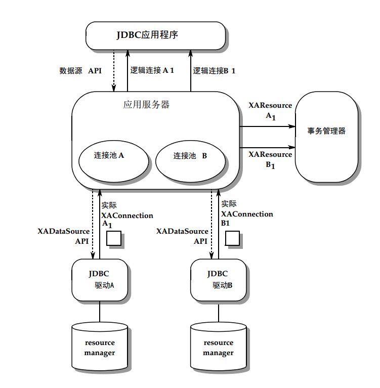

# 12. Distributed Transactions（分布式事务）

到目前为止，关于事务的讨论主要集中在本地事务上，即涉及单个数据源的事务。本章将介绍分布式事务的情况，其中一个事务涉及多个连接到一个或多个基础数据源。

以下讨论内容包括：
- 分布式事务基础设施
- 事务管理器和资源管理器
- `XADataSource`、`XAConnection` 和 `XAResource` 接口
- 两阶段提交

JDBC API 中的事务管理设计旨在与 Java 事务 API™（JTA）兼容。这里呈现的示例是高层次的；有关详细讨论，请参阅 JTA 规范。


## 12.1 基础设施
分布式事务需要提供以下角色的基础设施：

- **事务管理器** — 控制事务边界并管理两阶段提交协议。这通常是 JTA 的实现。
- **实现了 `XADataSource`、`XAConnection` 和 `XAResource` 接口的 JDBC 驱动**。这些接口将在下一节中描述。
- **一个对应用程序可见的 `DataSource` 实现**，用于“位于”每个 `XADataSource` 对象之上并与事务管理器进行交互。`DataSource` 实现通常由应用程序服务器提供。
- **资源管理器** — 管理基础数据。在 JDBC API 的上下文中，资源管理器是一个 DBMS 服务器。术语“资源管理器”源自 JTA，强调使用 JDBC API 的分布式事务遵循该文档中指定的体系结构。

这个基础设施通常在三层架构中实现，架构包括：

1. 客户端层
2. 包含应用程序、与外部事务管理器协作的 EJB 服务器以及一组 JDBC 驱动的中间层
3. 多个资源管理器

分布式事务也可以在两层架构中实现。在两层架构中，应用程序本身充当事务管理器，并直接与 JDBC 驱动的 `XADataSource` 实现进行交互。

以下图示说明了分布式事务基础设施的结构：



以下部分提供了有关该架构组件的更多详细信息。

## 12.2 XADataSource 与 XAConnection

`XADataSource` 和 `XAConnection` 接口定义在 `javax.sql` 包中，由支持分布式事务的 JDBC 驱动实现。`XAConnection` 对象是一个可以参与分布式事务的池化连接。更准确地说，`XAConnection` 扩展了 `PooledConnection` 接口，增加了 `getXAResource` 方法。此方法返回一个 `XAResource` 对象，该对象可以由事务管理器用于协调在该连接上完成的工作与分布式事务中的其他参与者。`XAConnection` 接口的定义如下所示：

```java
public interface XAConnection extends PooledConnection {
    javax.transaction.xa.XAResource getXAResource() throws SQLException;
}
```

因为 `XAConnection` 扩展了 `PooledConnection` 接口，所以 `XAConnection` 对象支持 `PooledConnection` 对象的所有方法。它们是可重用的物理连接，提供逻辑连接句柄，能够传递回 JDBC 应用程序。

`XAConnection` 对象由 `XADataSource` 对象生成。`XADataSource` 对象和 `ConnectionPoolDataSource` 对象有些相似，因为它们都在一个对 JDBC 应用程序可见的 `DataSource` 层下实现。这种架构允许 JDBC 驱动以对应用程序透明的方式支持分布式事务。`XADataSource` 接口中定义了两个 `getXAConnection` 方法，如下所示：

```java
public interface XADataSource {
    XAConnection getXAConnection() throws SQLException;
    XAConnection getXAConnection(String user, String password) throws SQLException;
}
```

通常，基于 `XADataSource` 实现构建的 `DataSource` 实现也会包括一个连接池模块。


### 12.2.1 部署 `XADataSource` 对象

部署 `XADataSource` 对象的方式与之前描述的 `ConnectionPoolDataSource` 对象的方式完全相同。这个两步的过程包括部署 `XADataSource` 对象和应用程序可见的 `DataSource` 对象，如 CODE EXAMPLE 12-3 所示。

```java
// com.acme.jdbc.XADataSource 实现了 
// XADataSource 接口。
// 创建一个实例并设置属性。
com.acme.jdbc.XADataSource xads = new com.acme.jdbc.XADataSource();
xads.setServerName("bookstore");
xads.setDatabaseName("bookinventory");
xads.setPortNumber(9040);
xads.setDescription("XADataSource for inventory");
// 首先使用逻辑名称 “jdbc/xa/inventory_xa” 将 xads 注册到
// JNDI 命名服务中
Context ctx = new InitialContext();
ctx.bind("jdbc/xa/inventory_xa", xads);
// 接下来，为应用程序访问注册上层的 DataSource 对象。
// com.acme.appserver.DataSource 是一个 DataSource 接口的实现。
// 创建一个实例并设置属性。
com.acme.appserver.DataSource ds = new com.acme.appserver.DataSource();
ds.setDescription("Datasource supporting distributed transactions");
// 引用之前注册的 XADataSource
ds.setDataSourceName("jdbc/xa/inventory_xa");
// 使用逻辑名称 “jdbc/inventory” 将 DataSource 实现注册到 JNDI 命名服务中。
ctx.bind("jdbc/inventory", ds);
```

**CODE EXAMPLE 12-3**：通过 `XADataSource` 对象支持的 DataSource 对象的部署

### 12.2.2 获取连接

与连接池的情况类似，应用程序调用 `DataSource.getConnection` 方法返回的是由物理 `XAConnection` 对象生成的逻辑句柄。获取逻辑连接的应用程序代码如 CODE EXAMPLE 12-4 所示。

```java
Context ctx = new InitialContext();
DataSource ds = (DataSource)ctx.lookup("jdbc/inventory");
Connection con = ds.getConnection("myID", "mypasswd");
```

**CODE EXAMPLE 12-4**：获取逻辑连接的应用程序代码

**CODE EXAMPLE 12-5** 是中间层服务器在 `DataSource.getConnection` 方法实现中的代码示例。

```java
// 假设 xads 是驱动程序对 XADataSource 的实现
XADataSource xads = (XADataSource)ctx.lookup("jdbc/xa/inventory_xa");
// xacon 实现了 XAConnection
XAConnection xacon = xads.getXAConnection("myID", "mypasswd");
// 获取一个逻辑连接并传递回应用程序
Connection con = xacon.getConnection();
```

**CODE EXAMPLE 12-5**：从 `XAConnection` 对象获取逻辑连接


## 12.3 XAResource

`XAResource` 接口是在 JTA 规范中定义的，它是 X/Open Group XA 接口在 Java 编程语言中的映射。`XAResource` 对象是通过调用 `XAConnection.getXAResource` 方法生成的，用于将 `XAConnection` 对象与分布式事务关联起来。在任何给定时间，一个 `XAConnection` 对象最多只能与一个事务关联。JDBC 驱动程序会在 `XAResource` 对象和其关联的 `XAConnection` 对象之间保持一对一的对应关系；也就是说，多次调用 `getXAResource` 方法必须返回相同的对象。

在典型的场景中，中间层应用服务器会调用 `XAConnection.getXAResource` 方法并将返回的对象传递给外部事务管理器。事务管理器会独占使用 `XAResource` 对象，它不会直接访问 `XAConnection` 对象。

事务管理器协调多个 `XAResource` 对象的工作，每个 `XAResource` 对象代表参与分布式事务的资源管理器。需要注意的是，两个 `XAResource` 对象可能指向同一个资源管理器，即它们可能与由同一个 `XADataSource` 生成的 `XAConnection` 对象关联。

以下是事务管理器用来实现两阶段提交协议的 `XAResource` 方法。每个方法都带有一个 `xid` 参数，用于标识分布式事务：

- **start**：通知资源管理器接下来的操作是分布式事务的一部分。
- **end**：标记该资源管理器参与的分布式事务的结束。
- **prepare**：获取资源管理器对是否提交或回滚分布式事务的投票。
- **commit**：通知资源管理器提交其参与的分布式事务部分。仅当所有参与的资源管理器都投票同意提交事务时，才会调用此方法。
- **rollback**：通知资源管理器回滚其参与的分布式事务部分。如果一个或多个参与的资源管理器投票回滚事务，则会调用此方法。

有关 `XAResource` 接口的完整描述，请参阅 JTA 规范。


## 12.4 事务管理

在分布式事务中，参与分布式事务的操作被定义为在调用 `XAResource.start` 和 `XAResource.end` 方法之间进行的工作。超出这些边界后，事务模式变为本地事务模式，此时连接的行为与普通的本地连接完全相同。

除了一个例外，参与分布式事务的应用程序代码与本地事务几乎没有区别。与本地事务不同的是，分布式事务的边界必须由协调多个连接工作的外部事务管理器控制。因此，当应用程序参与分布式事务时，调用以下 `Connection` 方法将会导致错误：

- `setAutoCommit(true)`
- `commit`
- `rollback`
- `setSavepoint`

如果尝试在参与分布式事务的连接上执行这些操作，JDBC 驱动程序将抛出 `SQLException` 异常。如果连接随后用于本地事务，这些操作在该情况下是合法的。

应用程序还应避免在分布式事务范围内调用 `Connection.setTransactionIsolation`。此时的行为是由具体实现定义的。

如果一个连接在加入全局事务时已经启用了自动提交模式，那么该属性将被忽略。当连接返回到本地事务模式时，自动提交行为将恢复。


### 12.4.1 两阶段提交

以下步骤概述了事务管理器如何使用 `XAResource` 对象来实现两阶段提交协议。这些步骤假设在一个三层架构中，应用服务器与外部事务管理器协同工作：

1. 应用服务器从两个不同的连接中获取 `XAResource` 对象：
    ```java
    // XAConA 连接到资源管理器 A
    javax.transaction.xa.XAResource resourceA = XAConA.getXAResource();
    // XAConB 连接到资源管理器 B 
    javax.transaction.xa.XAResource resourceB = XAConB.getXAResource();
    ```
    **代码示例 12-6** 从 `XAConnection` 对象获取 `XAResource` 对象

2. 应用服务器将 `XAResource` 对象传递给事务管理器。事务管理器不会直接访问相关联的 `XAConnection` 对象。

3. 事务管理器使用 `XAResource` 对象为每个相关的资源管理器分配事务的一部分。事务由 `xid` 标识，`xid` 是事务管理器在创建事务时生成的标识符。
    ```java
    // 将工作发送到资源管理器 A。TMNOFLAGS 参数表示我们正在启动事务的新分支，
    // 而不是加入或恢复现有分支。
    resourceA.start(xid, javax.transaction.xa.TMNOFLAGS);
    // 与资源管理器 A 进行工作
    ...
    // 告诉资源管理器 A 任务已完成，且没有发生错误
    resourceA.end(xid, javax.transaction.xa.TMSUCCESS);
    // 与资源管理器 B 进行工作。
    resourceB.start(xid, javax.transaction.xa.TMNOFLAGS);
    // B 的分布式事务部分
    ...
    resourceB.end(xid, javax.transaction.xa.TMSUCCESS);
    ```
    **代码示例 12-7** 使用 `XAResource` 接口启动和结束事务分支

4. 事务管理器通过询问每个参与者投票，启动两阶段提交协议：
    ```java
    resourceA.prepare(xid);
    resourceB.prepare(xid);
    ```
    **代码示例 12-8** 启动两阶段提交

    参与的资源管理器可以通过抛出 `javax.transaction.xa.XAException` 投票回滚事务。

5. 如果所有参与者都投票提交，事务管理器告诉每个资源管理器提交其分布式事务的部分（第二个参数告诉资源管理器不要为 `xid` 使用单阶段提交协议）：
    ```java
    resourceA.commit(xid, false);
    resourceB.commit(xid, false);
    ```
    **代码示例 12-9** 提交分布式事务

6. 如果任一资源管理器投票回滚，事务管理器告诉每个资源管理器回滚其事务部分：
    ```java
    resourceA.rollback(xid);
    resourceB.rollback(xid);
    ```
    **代码示例 12-10** 回滚分布式事务

事务管理器在提交或回滚事务分支时不需要使用与执行该分支时相同的 `XAResource` 对象。然而，如果使用不同的 `XAResource` 对象，它们必须与连接到相同资源管理器的 `XAConnection` 对象关联。

---

**注意**：步骤 1-6 同样适用于 `XAConA` 和 `XAConB` 是连接到同一个资源管理器的两个物理连接的情况。


## 12.5 关闭连接

在典型的分布式事务环境中，中间层服务器需要在应用程序完成连接使用时收到通知。与之前讨论的 `PooledConnection` 对象类似，中间层服务器会将自己添加为 `ConnectionEventListener`，以便在应用程序调用 `Connection.close` 方法时收到通知。这时，服务器会通知事务管理器，以便其结束对应的 `XAResource` 对象的事务分支。如果服务器的 `DataSource` 实现包含连接池模块，该模块会被通知，可以将物理的 `XAConnection` 对象返回到连接池。

---

**注意**：在关闭参与的 `Connection` 对象后，分布式事务可能仍然处于活动状态。对于本地事务则不然。

---

## 12.6 XAResource 接口的局限性

`javax.transaction.xa.XAResource` 接口仅限于定义加入和参与全局事务所需的方法集，这些方法集是由 X/Open XA 标准定义的。这使得任何实现该接口的资源管理器都能够与具有相同支持级别的其他资源管理器或事务管理器一起参与。

X/Open 标准中未定义的功能在 `XAResource` 接口中也没有相应定义。支持 X/Open XA 标准未定义的功能（例如在全局事务中设置隔离级别）的资源管理器必须通过实现定义的方式来实现这些功能。使用实现定义功能的用户应意识到这会限制其应用程序的可移植性。


