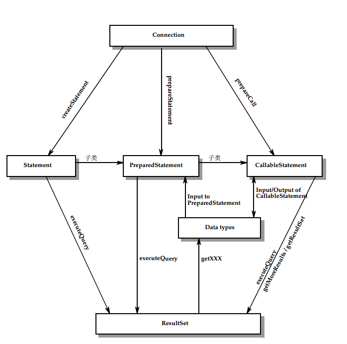
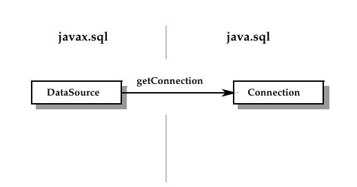
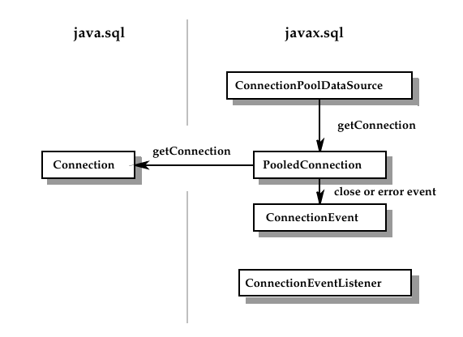
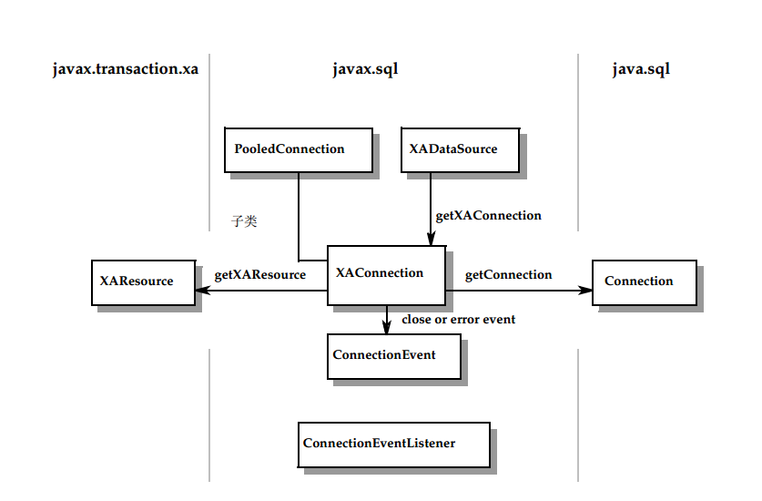
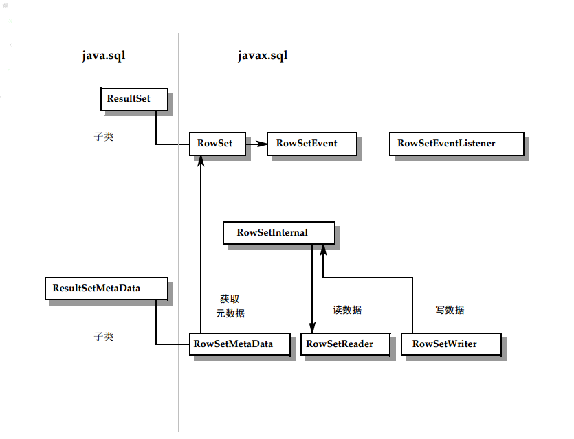

# 5. Classes and Interfaces（类与接口）

## 5.1 java.sql 包

核心 JDBC API 包含在 `java.sql` 包中。以下是 `java.sql` 包中的枚举、类和接口。枚举和类使用粗体表示；接口使用标准字体表示。

java.sql.Array

**java.sql.BatchUpdateException**

java.sql.Blob

java.sql.CallableStatement

java.sql.Clob

java.sql.ClientinfoStatus

java.sql.Connection

**java.sql.DataTruncation** 

java.sql.DatabaseMetaData

**java.sql.Date** 

java.sql.Driver

java.sql.DriverAction

**java.sql.DriverManager** 

**java.sql.DriverPropertyInfo**

**java.sql.JDBCType**

java.sql.NClob

java.sql.ParameterMetaData

 java.sql.PreparedStatement

 **java.sql.PseudoColumnUsage**

 java.sql.Ref

 java.sql.ResultSet

 java.sql.ResultSetMetaData

 java.sql.RowId

 **java.sql.RowIdLifeTime**

 java.sql.Savepoint

 **java.sql.SQLClientInfoException**

 java.sql.SQLData

 **java.sql.SQLDataException**

 **java.sql.SQLException** 

**java.sql.SQLFeatureNotSupportedException** 

java.sql.SQLInput

 **java.sql.SQLIntegrityConstraintViolationException** 

**java.sql.SQLInvalidAuthorizationSpecException** 

**java.sql.SQLNonTransientConnectionException** 

**java.sql.SQLNonTransientException** 

java.sql.SQLOutput

 java.sql.SQLPermission

 **java.sql.SQLSyntaxErrorException** 

**java.sql.SQLTimeoutException** 

**java.sql.SQLTransactionRollbackException** 

**java.sql.SQLTransientConnectionException** 

**java.sql.SQLTransientException**

 java.sql.SQLType

 java.sql.SQLXML 

**java.sql.SQLWarning** 

java.sql.Statement

 java.sql.Struct

 **java.sql.Time** 

**java.sql.Timestamp** 

**java.sql.Types**

 java.sql.Wrapper

以下类和接口在JDBC4.2 API中是新的或更新的。
新类和接口以粗体突出显示

java.sql.BatchUpdateException

 java.sql.CallableStatement

 java.sql.Connection

 java.sql.DatabaseMetaData

 java.sql.Date

 java.sql.Driver

 **java.sql.DriverAction**

 java.sql.DriverManager

 **java.sql.JDBCType**

 java.sql.Permission

 java.sql.PreparedStatement

 java.sql.ResultSet

 java.sql.SQLInput

 java.sql.SQLOutput

 **java.sql.SQLType**

 java.sql.SQLXML

 java.sql.Statement

 java.sql.Types

 java.sql.Timestamp

 javax.sql.XADataSource

 图5-1显示了关键类和
java.sql包中的接口。创建语句所涉及的方法，
还显示了设置参数和检索结果。

## 5.2 javax.sql包
以下列表包含中包含的类和接口
javax.sql包。类以粗体突出显示；接口为正常类型

 javax.sql.CommonDataSource 

**javax.sql.ConnectionEvent**

  javax.sql.ConnectionEventListener

 javax.sql.ConnectionPoolDataSource 

javax.sql.DataSource 

javax.sql.PooledConnection

 javax.sql.RowSet

 **javax.sql.RowSetEvent** 

 javax.sql.RowSetInternal 

javax.sql.RowSetListener

 javax.sql.RowSetMetaData 

javax.sql.RowSetReader

 javax.sql.RowSetWriter

 **javax.sql.StatementEvent**

 javax.sql.StatementEventListener

 javax.sql.XAConnection

 javax.sql.XADataSource

---

**注意**：`javax.sql` 包中的类和接口最初作为 JDBC 2.0 可选包提供。这个可选包以前与 `java.sql` 包是分开的，`java.sql` 包是 J2SE 1.2 的一部分。从 J2SE 1.4 开始，`java.sql` 和 `javax.sql` 两个包现在都是 Java SE 的一部分。

---

**图 5-2**、**图 5-3**、**图 5-4** 和 **图 5-5** 显示了在以下功能领域中关键类和接口之间的关系：`DataSource` 对象、连接池、分布式事务和行集。

